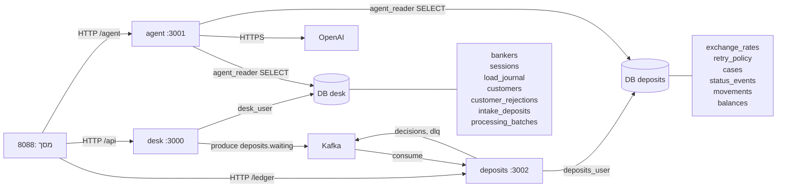

# סכמה

```mermaid
flowchart LR
  screen["מסך :8088"]
  desk["desk :3000"]
  deposits["deposits :3002"]
  agent["agent :3001"]
  kafka["Kafka"]
  openai["OpenAI"]

  dbDesk[("DB desk")]
  deskTables["bankers<br/>sessions<br/>load_journal<br/>customers<br/>customer_rejections<br/>intake_deposits<br/>processing_batches"]

  dbDeposits[("DB deposits")]
  depositsTables["exchange_rates<br/>retry_policy<br/>cases<br/>status_events<br/>movements<br/>balances"]

  screen -->|"HTTP /api"| desk
  screen -->|"HTTP /ledger"| deposits
  screen -->|"HTTP /agent"| agent
  desk -->|"produce deposits.waiting"| kafka
  kafka -->|"consume"| deposits
  deposits -->|"decisions, dlq"| kafka
  desk -->|"desk_user"| dbDesk
  dbDesk --- deskTables
  deposits -->|"deposits_user"| dbDeposits
  dbDeposits --- depositsTables
  agent -->|"agent_reader SELECT"| dbDesk
  agent -->|"agent_reader SELECT"| dbDeposits
  agent -->|"HTTPS"| openai
```
